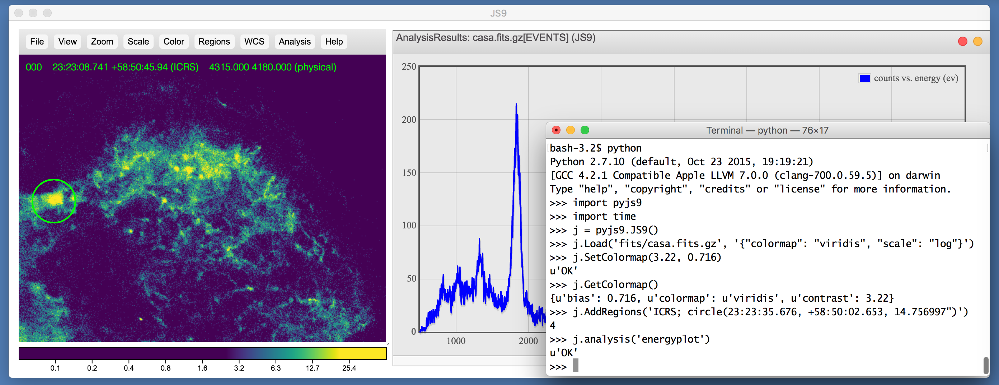

JS9: astronomical image display everywhere
==========================================

What does it do?
----------------

  - display FITS images, binary tables, data cubes, and multi-extension files
  - colormaps, scaling, pan, zoom, binning, blending, print, export ...
  - region support: create, manipulate, import, export, ...
  - drag and drop images, regions, catalogs
  - server-side and local analysis using the JS9 public API
  - control JS9 using scripts from the Linux shell or Python
  - runs on Macs, Linux, Windows, iPads, iPhones, ...
  - runs as a Desktop app in all modern browsers
  - utilizes WebAssembly (FITS processing at near native speed!)

How can I try it out?
---------------------

Go to [JS9 web site](https://js9.si.edu) and drag a
[FITS](https://fits.gsfc.nasa.gov/) data file onto the JS9 display:

    https://js9.si.edu

You can even specify a remote FITS file and associated image display parameters
as part of the URL:

    https://js9.si.edu/js9/js9.html?url=https://hea-www.cfa.harvard.edu/~eric/coma.fits.gz&colormap=cool

The JS9 web site also contains on-line documentation, demos, and
release downloads.

To install or not to install ...
--------------------------------

For many users, there is no need to install JS9: simply use the [JS9 web
site](https://js9.si.edu) to display your data. You can even upload your
FITS files to the web site and run our server-side analysis.

Installing JS9 allows you to create your own web pages, tailor site
parameters, and add your own local and server-based analysis tasks. Grab the
latest version from [JS9 on GitHub](https://github.com/ericmandel/js9):

    git clone https://github.com/ericmandel/js9

Load a local page into your browser:

    file:///path/to/js9/js9.html

(NB: Chrome needs to run with the --allow-file-access-from-files switch to use
the file URI.)

For Desktop use, install [Electron.js](https://www.electronjs.org/)
and use the *js9* script to start the Desktop app and load an image:

    js9 -a ~/data/m13.fits

For more advanced support (web-based support, support for handling large files),
build the JS9 helper and install JS9 in a web directory:

    # configure location to install the JS9 web files,
    # where to find cfitsio library and include files,
    # where to install programs and scripts,
    # what sort of helper to build:
    ./configure --with-webdir=[path_to_web_install] \
                --with-cfitsio=[path_to_cfitsio]    \
                --prefix=[path_to_prog_install]     \
                --with-helper=nodejs

    # the usual ...
    make
    make install

    # start helper
    cd path_to_web_install
    # in the bash shell:
    node js9Helper.js 1>~/logs/js9node.log 2>&1 &
    # or, in the tcsh shell:
    node js9Helper.js >& ~/logs/js9node.log &

What about scripting?
---------------------

The *js9* script allows you to control a JS9 web page from the Linux
command line using the JS9 Public API (scripting requires installation of
JS9 and either [node.js](https://nodejs.org/) or
[Electron.js](https://www.electronjs.org/)):

    js9 Load chandra.fits '{"scale":"log","colormap":"red","contrast":5.78,"bias":0.15}'
    js9 Load spitzer.fits '{"scale":"log","colormap":"blue","contrast":6.3,"bias":0.54}'
    js9 ReprojectData chandra.fits

Python users can install [pyjs9](https://github.com/ericmandel/pyjs9):

    git clone https://github.com/ericmandel/pyjs9
    ...
    import pyjs9
    j = pyjs9.JS9()
    j.Load('chandra.fits', '{"scale":"log","colormap":"red","contrast":5.78,"bias":0.15}')
    j.Load('spitzer.fits', '{"scale":"log","colormap":"blue","contrast":6.3,"bias":0.54}')
    j.ReprojectData('chandra.fits')

What's the license?
-------------------

JS9 is distributed under the terms of The MIT License.

What's the recent release history?
----------------------------------
  __v3.6.1__ &nbsp; (08/16/2021)

  __v3.6.0__ &nbsp; (07/30/2021)

  __v3.5.0__ &nbsp; (06/01/2021)

  __v3.4.0__ &nbsp; (05/05/2021)

 __v3.3.1__ &nbsp; (12/15/2020)

 __v3.3.0__ &nbsp; (12/14/2020)

 __v3.2.0__ &nbsp; (11/06/2020)

 __v3.1.0__ &nbsp; (09/08/2020)

 __v3.0.0__ &nbsp; (01/06/2020)

 __v2.5.0__ &nbsp; (08/30/2019)

Who's responsible?
------------------

Eric Mandel, Alexey Vikhlinin

Center for Astrophysics | Harvard & Smithsonian
